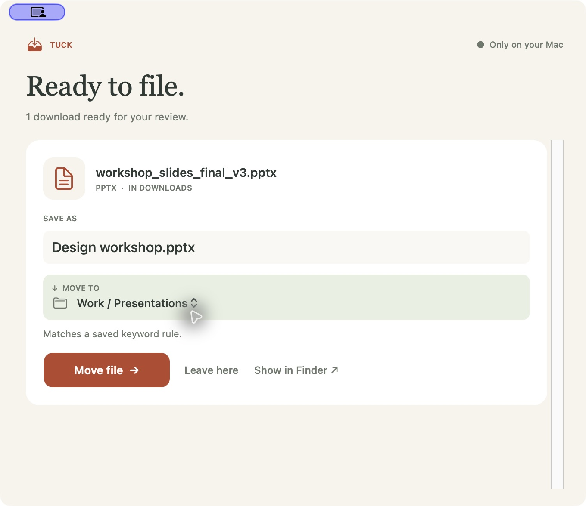
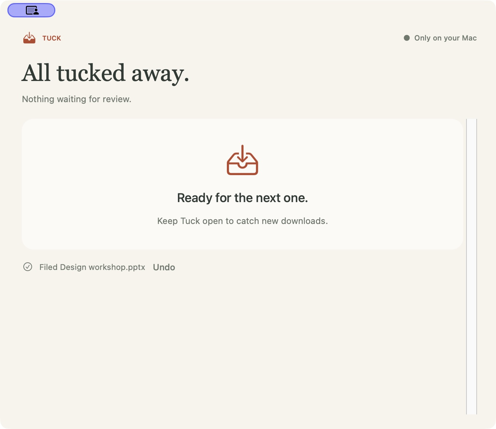

# Tuck

Tuck sits in your Mac’s menu bar and helps keep Downloads organised. When a file finishes downloading, it suggests a name and somewhere to put it. You can change either before moving it, or leave the file where it is.




It runs in the background. Suggestions come from a small model running on your Mac, using your own folder map. Nothing moves automatically.

After a move, you can reveal the file in Finder or undo it. Existing files are never overwritten.



The menu bar is illustrated. App screenshots use example files and folders.

## Install

Requires Apple Silicon, Python 3.12 or newer, and Xcode Command Line Tools. Run these from the repository folder.

```sh
./scripts/install.sh
.venv/bin/python -m download_suggest download-model
open ~/Applications/Tuck.app
```

The model downloads once. Keep the repository in place and Tuck open while using it. Add Tuck to macOS Login Items if you want it to start when you sign in.

[Setup and configuration](docs/setup.md) · [Example folder map](examples/config.example.json)

## Privacy

Suggestions run locally through TinyJev and MLX. Tuck does not upload documents or collect telemetry.

Your folder map, queue and history are stored in `~/Library/Application Support/Tuck`. The history includes recommendations, your chosen names and folders, and the model and prompt instructions. It keeps track of corrections for comparing future versions, without storing document bodies.

Personal configuration, logs and model weights are excluded from Git. A publication check also rejects decision logs if they are accidentally staged.

## Current limits

Tuck reads limited text from PDFs, PowerPoint slides and text files. It uses filenames for images and scanned PDFs. There is no OCR.

In four checks on an M3 Max, downloads reached the review queue in 0.6 to 0.7 seconds with the model already loaded. Startup and larger files can take longer. If the model is unavailable, you can choose the folder yourself.

## Development

There are 23 end-to-end tests covering file moves, edited suggestions, Undo, collisions, deleted files, restart recovery, extraction, logging and privacy checks. Commands and implementation details are in [the development notes](docs/setup.md).

[MIT license](LICENSE)
